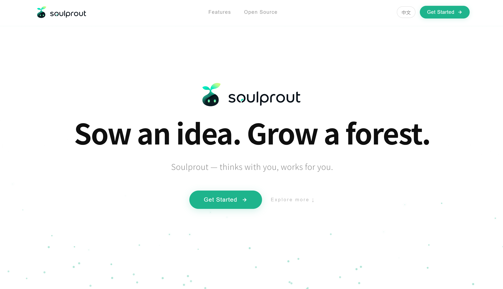
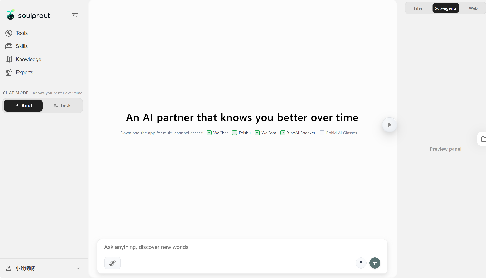

# soulprout-agent

English | [简体中文](README.zh-CN.md)

A lightweight yet full-featured Agent framework.

## Core Capabilities

1. **Harness engineering**: User personalization, agent personalization, memory, context compression, tools, skills, blueprint planning, and more.
2. **AI knowledge base**: Built for industry and domain scenarios with massive materials. Package large volumes of content into a single knowledge base with vector retrieval and agent-driven retrieval.
3. **Expert library**: For complex workflows in specific domains — designed for users with zero AI background. Turn domain workflows into agent workflows through zero-code, interactive dialogue. Automatically matches tools, skills, knowledge bases, and sub-experts. Create an expert once and reuse it forever.
4. **Soul mode**: Optimized for end users. Persists user personalization, desired agent personality, and memories — so your agent understands you better over time. Invoke existing experts and let your personal assistant supervise AI work.
5. **Task mode**: Start a new task conversation anytime and let the agent focus on a single job.
6. **Multi-platform integration**: Soul-mode agents connect to WeChat, Feishu, WeCom, Xiaomi Xiao Ai speakers, AI glasses, and more — talk to your agent assistant from any channel.
7. **Four integrated libraries**: Tools, skills, knowledge bases, and expert libraries work together to cover everything an agent should have.
8. **PC and SaaS deployment**: Run on your own PC for personal use, or deploy as a multi-user SaaS site for enterprise teams.

## Visualization

A polished visual interface makes agent workflows accessible to non-technical users with zero setup friction.

**Home page**



**Chat page**



1. **Web UI**: Browse tools, upload skills and knowledge bases, and create experts in a refined web app. Chat with your agent end to end — see full tool outputs, file previews, web previews, and sub-agent invocations.
2. **Human–agent collaboration**: Edit agent-produced files directly when output isn’t right, or revise any past input and continue the conversation.
3. **Gateway client**: Connect WeChat, Feishu, Xiao Ai, and other channels by downloading the Gateway client and scanning to bind — no extra software to deploy on your PC.

## Notes

By the end of June, this project will be deployed on a public website for free use. URL: (TBD)

Built by an independent developer over two and a half years of continuous work, with three major refactors — now open source.

Still in active development. This is an early release: some features may be missing and bugs may exist, but core functionality works.

---

## Quick Start (Local Deployment)

### Prerequisites

| Tool | Version |
|------|---------|
| Python | 3.10+ |
| Node.js | 18+ |
| Docker | latest ([Docker Desktop](https://www.docker.com/products/docker-desktop/) on Windows) |

### Linux / macOS

One-command scripts (recommended):

```bash
bash deploy/install.sh    # install
bash deploy/start.sh      # start
bash deploy/stop.sh       # stop (add --with-db to stop databases)
```

### Windows

From the project root in **CMD / PowerShell / terminal**, run these steps in order (Docker Desktop must be running).

#### 1. Python virtualenv and dependencies

```bat
python -m venv .venv
.venv\Scripts\activate

pip install -r agent\requirements.txt
pip install -r vdb\requirements.txt
pip install -r gateway\requirements.txt
```

#### 2. Web frontend dependencies

```bat
cd web
npm install
cd ..
```

#### 3. Configuration files

Copy templates and fill in secrets (skip if already present):

```bat
copy agent\.env.example agent\.env
copy agent\.model.json.example agent\.model.json
copy vdb\.env.example vdb\.env
copy gateway\.env.example gateway\.env
```

| File | Required |
|------|----------|
| `agent/.env` | Yes |
| `agent/.model.json` | Yes |
| `vdb/.env` | Yes |
| `gateway/.env` | No |

#### 4. Start MongoDB (Docker)

```bat
docker pull mongo:latest
docker run -d --name mongo --restart unless-stopped -p 127.0.0.1:27017:27017 -v %cd%\deploy\data\mongo\data:/data/db mongo:latest
```

If the container already exists: `docker start mongo`

#### 5. Start Milvus (Docker)

Requires [Git Bash](https://git-scm.com/download/win) or another bash shell:

```bash
cd vdb
bash standalone_embed.sh start
cd ..
```

#### 6. Start services

**One terminal per service.** Activate the venv first: `.venv\Scripts\activate`

```bat
python vdb\main.py
```

```bat
python agent\main.py
```

```bat
python gateway\main.py
```

```bat
cd web
npm run dev
```

#### Stop

- `Ctrl+C` in each terminal
- Databases: `docker stop mongo`; Milvus: `cd vdb && bash standalone_embed.sh stop`

---

### URLs

| Service | URL |
|---------|-----|
| Web frontend | http://localhost:5173 |
| Agent API | http://localhost:8080 |
| VDB service | http://localhost:8888 |
| Gateway (optional) | http://localhost:8082 |

---

## Project Structure

```
soulprout-agent/
├── agent/          # Core Agent backend (FastAPI, port 8080)
├── vdb/            # Vector DB service (FastAPI, port 8888)
├── web/            # Web frontend (Vue 3 + Vite, port 5173)
├── gateway/        # Platform gateway — WeChat / Feishu / WeCom (port 8082)
├── deploy/
│   ├── install.sh
│   ├── start.sh
│   ├── stop.sh
│   └── lib/common.sh
└── logs/           # Runtime logs (auto-created)
```

---

## Docker Network

MongoDB is bound to `127.0.0.1:27017` and is **not** exposed to the public internet.

---

## Troubleshooting

| Issue | Fix |
|-------|-----|
| `docker: command not found` | Install and start Docker Desktop |
| Milvus fails to start | Ensure Docker has enough RAM (~2 GB); check `vdb/standalone_embed.sh` |
| `agent/.model.json not found` | Copy from `agent/.model.json.example` and fill in API keys |
| Port already in use | Linux/macOS: `bash deploy/stop.sh`; Windows: kill the process on that port |
