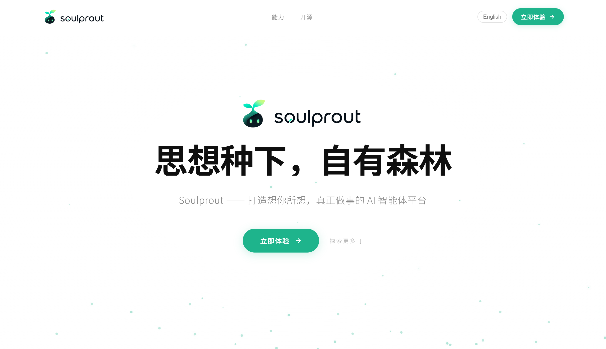
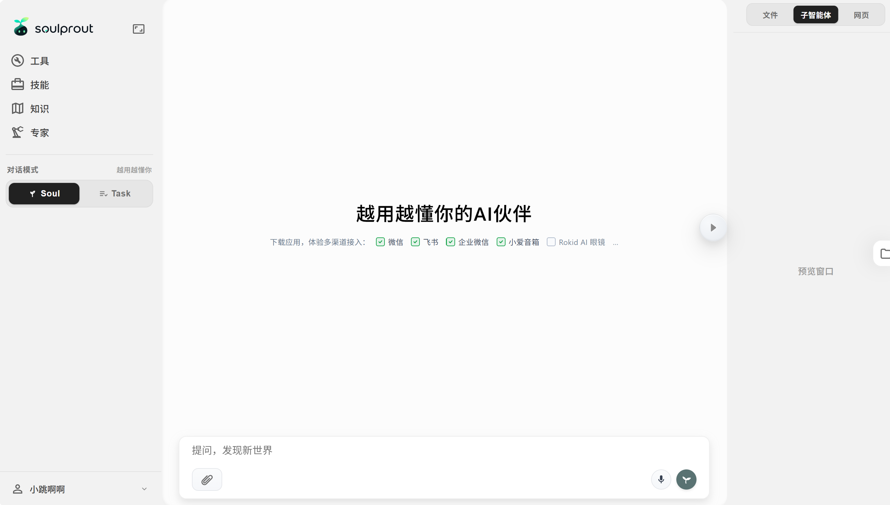

# soulprout-agent

[English](README.md) | 简体中文

一个轻量级但全能的 Agent 框架。

## 核心能力

1. **Harness 工程能力**：拥有用户个性化、Agent 个性化、记忆系统、上下文压缩、工具、技能、蓝图规划等能力。
2. **AI 知识库**：面向行业/领域海量资料场景，拥有单独的 AI 知识库系统，支持将海量资料打包成一个知识库，具备向量检索与 Agent 检索能力。
3. **专家库**：面向特定领域复杂工作流模式，服务零 AI 基础人群，可零代码、交互式对话来将领域内复杂工作流程转为 Agent 流程，自动匹配工具、技能、知识库、子专家，一次创建专家，即可永久复用。
4. **Soul 模式**：面向 C 端用户优化，可以将用户个性化特征，或是用户希望 Agent 的个性化特征，以及记忆进行保存，收获一个越用越懂你的 Agent。还可以调用已经存在的专家，让你的个人助理监督 AI 干活。
5. **任务模式**：随时创建一个新的任务对话，让 Agent 专心执行一个任务。
6. **多平台集成**：Soul 模式的 Agent 支持接入微信、飞书、企业微信、小爱音箱、AI 眼镜等渠道。让你在任何渠道都可以和你自己的 Agent 助理进行沟通。
7. **四大功能库**：工具库、技能库、知识库、专家库间相互配合，集成所有 Agent 该有的能力。
8. **PC 和 SaaS 部署**：本项目既支持 C 端个人部署在自己的 PC 上，也支持 B 端企业为自己的员工部署 SaaS 网站模式，并通过多用户的方式进行登录。

## 可视化

你会使用到一个精致的可视化页面来完成日常工作，这让非技术用户零门槛使用 Agent 成为可能。

**主页**



**对话页**



1. **Web 可视化**：你可以使用一个精致的 Web 页面来查看工具、上传技能、上传知识库、创建专家。并使用聊天框来完成和 Agent 对话的整个流程，你可以看到完整的工具返回结果，文件预览、网页预览和子智能体调用过程。
2. **人机协作办公**：如果你对 Agent 产出的内容不满意，你可以直接修改产出的文件内容，也可以任意编辑自己曾经的输入，并重新对话。
3. **Gateway 可视化**：如果你想接入微信、飞书、小爱音箱等渠道，可以直接下载 Gateway 客户端扫码完成绑定，而不需要你在自己的电脑上部署任何程序。

## 小记

六月底前，该项目会部署到网站上供大家免费使用。网站地址：(待定)

本项目由独立开发者开发，持续开发此项目已两年半，中间经过三次大的项目重构，并决定开源。

目前仍在持续开发中，当前版本为初版，可能有功能缺失和 Bug，但基本功能正常。

---

## 快速开始（本地部署）

### 前置依赖

| 工具 | 版本要求 |
|------|----------|
| Python | 3.10+ |
| Node.js | 18+ |
| Docker | 最新版（Windows 用 [Docker Desktop](https://www.docker.com/products/docker-desktop/)） |

### Linux / macOS

一键脚本（推荐）：

```bash
bash deploy/install.sh    # 安装
bash deploy/start.sh      # 启动
bash deploy/stop.sh       # 停止（加 --with-db 同时停数据库）
```

### Windows

在 **CMD / PowerShell / 终端** 中，进入项目根目录，按顺序手动执行（需先启动 Docker Desktop）。

#### 1. Python 虚拟环境与依赖

```bat
python -m venv .venv
.venv\Scripts\activate

pip install -r agent\requirements.txt
pip install -r vdb\requirements.txt
pip install -r gateway\requirements.txt
```

#### 2. Web 前端依赖

```bat
cd web
npm install
cd ..
```

#### 3. 配置文件

从模板复制并填写密钥（已存在则跳过）：

```bat
copy agent\.env.example agent\.env
copy agent\.model.json.example agent\.model.json
copy vdb\.env.example vdb\.env
copy gateway\.env.example gateway\.env
```

| 文件 | 是否必填 |
|------|----------|
| `agent/.env` | 必填 |
| `agent/.model.json` | 必填 |
| `vdb/.env` | 必填 |
| `gateway/.env` | 选填 |

#### 4. 启动 MongoDB（Docker）

```bat
docker pull mongo:latest
docker run -d --name mongo --restart unless-stopped -p 127.0.0.1:27017:27017 -v %cd%\deploy\data\mongo\data:/data/db mongo:latest
```

容器已存在时改用：`docker start mongo`

#### 5. 启动 Milvus（Docker）

需 [Git Bash](https://git-scm.com/download/win) 或同类 bash 环境：

```bash
cd vdb
bash standalone_embed.sh start
cd ..
```

#### 6. 启动各服务

**每个服务占一个终端**，均先激活虚拟环境：`.venv\Scripts\activate`

```bat
python vdb\main.py
```

```bat
python agent\main.py
```

```bat
python gateway\main.py
```

```bat
cd web
npm run dev
```

#### 停止

- 各终端 `Ctrl+C` 结束进程
- 数据库：`docker stop mongo`；Milvus：`cd vdb && bash standalone_embed.sh stop`

---

### 访问地址

| 服务 | 地址 |
|------|------|
| Web 前端 | http://localhost:5173 |
| Agent API | http://localhost:8080 |
| VDB 服务 | http://localhost:8888 |
| Gateway（可选） | http://localhost:8082 |

---

## SaaS 模式部署（Linux）

本地私有化用 `DEPLOYMENT_MODE=private` 即可。若部署多用户 SaaS，在完成上方安装后额外完成：

1. **`agent/.env`**
   - `DEPLOYMENT_MODE=saas`
   - 配置阿里云邮件推送（邮箱验证码登录）：`ALIYUN_DM_*`、`ALIYUN_ACCESS_KEY_*`
   - 设置 `FRONTEND_URL`（公网访问地址）、`JWT_SECRET_KEY`（生产务必改为随机串）
2. **安装 bash 沙盒**（共享 Python/Node 运行时，隔离每个对话目录）  
   需系统已有 `python3`（含 venv）、`curl`、`bubblewrap`：
   ```bash
   # Ubuntu/Debian 示例
   sudo apt install -y python3 python3-venv curl bubblewrap
   sudo bash deploy/sandbox.sh
   ```
3. 用 `bash deploy/start.sh` 启动服务。

沙盒默认目录：`/opt/soulprout/sandbox`（可用环境变量 `SAAS_SANDBOX_ROOT` 覆盖）。

---

## 项目结构

```
soulprout-agent/
├── agent/          # Agent 后端（FastAPI，端口 8080）
├── vdb/            # 向量数据库服务（FastAPI，端口 8888）
├── web/            # Web 前端（Vue 3 + Vite，端口 5173）
├── gateway/        # 平台网关 — 微信 / 飞书 / 企业微信（端口 8082）
├── deploy/
│   ├── install.sh
│   ├── start.sh
│   ├── stop.sh
│   ├── sandbox.sh  # SaaS bash 沙盒（共享 Python/Node）
│   └── lib/common.sh
└── logs/           # 运行日志（自动生成）
```

---

## Docker 网络说明

MongoDB 绑定在 `127.0.0.1:27017`，**不会**暴露到公网。

> 网络问题导致 Docker 镜像拉取失败？参考：[Docker 镜像加速配置](https://blog.csdn.net/qingzhumuqingfeng/article/details/144094325)

---

## 常见问题

| 问题 | 解决方法 |
|------|----------|
| `docker: command not found` | 安装并启动 Docker Desktop |
| `Milvus 启动失败` | 确认 Docker 有足够内存（约 2 GB）；检查 `vdb/standalone_embed.sh` |
| `agent/.model.json not found` | 从 `agent/.model.json.example` 复制并填写 API Key |
| 端口被占用 | Linux/macOS 用 `bash deploy/stop.sh`；Windows 结束占用端口的进程 |
